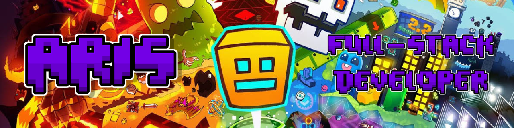

  

# Aris

### Game Developer • Full-Stack Developer • Mod Developer

Building games, tools and experiences.

 

---

# 👋 About Me

I'm a **Brazilian game and software developer** passionate about building games, developer tools, and modern web applications.

I primarily work with **Geometry Dash**, **Roblox**, and full-stack development, creating everything from mods and launchers to websites, APIs, and Discord bots.

Outside of programming, I'm always experimenting with new ideas and turning them into real projects.

- 🎮 Developing games and experiences
- 🛠️ Creating mods, launchers and desktop applications
- 🌐 Building modern websites & dashboards
- 🤖 Developing Discord bots and automation
- 🚀 Always learning something new

---

# 💻 Languages

# 🛠 Technologies

  
# ⚙️ Development Environment

# 🔥 Featured Projects

| Project | Description | Stack | Status |
|:--|:--|:--|:--:|
| **Platinum GDPS** | Custom Geometry Dash Private Server with unique gameplay features, events and progression. | `PHP` `C++` `SQLite` | 🟢 Active |
| **Platinum DL** | Official Demon List featuring profiles, submissions, moderation, rankings and statistics. | `JavaScript` `Cloudflare` `D1` `HTML/CSS` | 🟢 Active |
| **Replay Bot** | Frame-perfect replay bot for Geometry Dash 1.9 with recording and playback support. | `C++` | 🟢 Active |
| **Filter+** | Advanced Geometry Dash level search powered by Geode. | `C++` `Geode` | 🔵 Beta |
| **BnuuyBot** | Multipurpose Discord bot developed by **BnuuyWorks**, featuring moderation, utility and automation. | `Node.js` `Discord.js` | 🟡 In Development |

---

# 📊 GitHub Statistics

 

 

 

---

### Thanks for stopping by! 👋

> *"Building things people enjoy using."*

⭐ If you like one of my projects, consider leaving a star.

