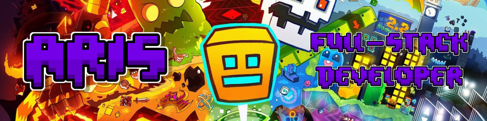

<p align="center">
  
</p>

<div align="center">

# Aris

<p align="center">
  
</p>

### Game Developer • Full-Stack Developer • Mod Developer

Building games, tools, websites, bots, and questionable pieces of software.

<br>

[](https://linktr.ee/heyariss)
[](https://github.com/local-nero)
[](https://discord.gg/Q5kYgSNkFj)
[](mailto:dunereal.business@gmail.com)

<p align="center">


</p>

</div>

---

# 👋 About Me

I'm a **Brazilian game and software developer** who enjoys turning random ideas into actual projects.

Most of my work revolves around **Geometry Dash**, **Roblox**, web development, and Discord bots, but I tend to build whatever sounds interesting.

I've worked on everything from game mods and tools to full-stack websites with authentication, databases, APIs, server-side game logic, and cloud-hosted infrastructure.

- 🎮 Developing games and interactive experiences
- 🛠️ Creating Geometry Dash mods and tools
- 🌐 Building full-stack websites & dashboards
- ☁️ Working with serverless infrastructure and databases
- 🤖 Developing Discord bots and automation
- 🔌 Building APIs and backend systems
- 🚀 Constantly experimenting with new projects

---

# 💻 Languages

<p>


</p>

# 🛠 Technologies

<p>


</p>

# ⚙️ Development Environment

<p>


</p>

---

# 🔥 Featured Projects

| Project | Description | Stack | Status |
|:--|:--|:--|:--:|
| **💧 Soggybet** | Parody casino where fictional SoggyCoins are gambled for increasingly soggy cats. Features accounts, cloud saves, a server-authoritative economy and multiple games. | `JavaScript` `Cloudflare` `D1` `HTML/CSS` | 🟢 Active |
| **🤖 Soggybot** | Multipurpose Discord bot with economy, moderation, utility, fun and automation systems. | `Node.js` `Discord.js` | 🟢 Active |
| **🔎 Filter+** | Advanced Geometry Dash level-search and filtering mod powered by Geode. | `C++` `Geode` | 🔵 Beta |

---

# 💧 Current Focus

### Soggybet

Currently building **Soggybet**, a full-stack parody gambling website centered around fictional currency and collectible soggy cats.

What started as a small frontend experiment now includes:

- 👤 account registration & authentication
- ☁️ server-side cloud saves
- 🗄️ Cloudflare D1
- 🔐 server-authoritative economy
- 🎰 server-backed games
- 🐈 collectible Soggies
- 📦 inventories
- 💸 selling systems
- 🎁 daily rewards
- 🛟 anti-softlock protection
- 🔄 legacy save migration
- ⚡ ongoing performance optimization

> no real money. no crypto. no NFTs. just increasingly soggy cats.

---

# 🧠 Things I Work With

```text
Game Development
├── Roblox
├── Geometry Dash
├── Geode
└── Lua / C++

Web Development
├── HTML / CSS
├── JavaScript
├── TypeScript
├── PHP
└── REST APIs

Backend
├── Cloudflare Pages Functions
├── Cloudflare D1
├── SQLite / SQL
├── Authentication
└── Server-authoritative systems

Bots & Automation
├── Node.js
├── Discord.js
├── Moderation systems
└── Economy systems
```

---

# 📊 GitHub Statistics

<div align="center">


<br>


<br>


<br>

</div>

---

# 🚀 What I'm Building

I usually have at least one project being rewritten, broken, fixed, rewritten again, or somehow turned into something significantly larger than originally planned.

Current areas of interest:

- 🎮 game development
- 🧩 Geometry Dash modding
- 🌐 full-stack web development
- ☁️ serverless infrastructure
- 🗄️ databases & backend architecture
- 🤖 Discord bots
- 🔐 authentication & account systems
- 🎨 UI/UX
- ⚡ performance optimization

---

<div align="center">

### Thanks for stopping by! 👋

> *"Building things people enjoy using."*

⭐ If you like one of my projects, consider leaving a star.

<br>

**currently attempting to achieve maximum sog. 💧**

</div>
